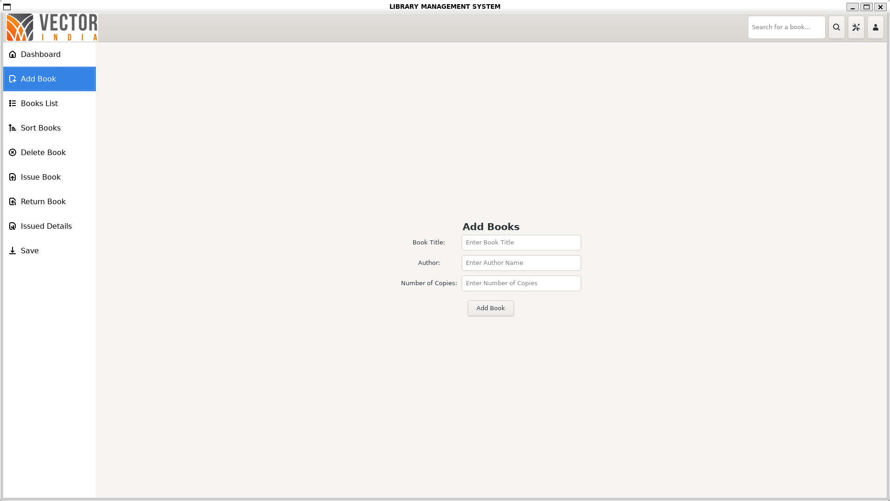

## GTK3 Installation
Before building the project, make sure GTK3 development packages are installed on your system.

### Ubuntu:
```bash
sudo apt update
sudo apt install libgtk-3-dev
```

### To verify the installation:
```bash
pkg-config --cflags gtk+-3.0
```

## Build Instructions
To build the project, navigate to the project directory and run:
```bash
make
```

## Run Instructions
To run the project, use:
```bash
make run
```

## Clean Instructions
To clean the project, use:
```bash
make clean
```

---

## About Library Management System

Welcome to the **Ultimate Library Management System** — your all-in-one solution for seamless library operations! 🚀

This modern application, crafted in C with a stunning GTK3 interface, empowers you to take full control of your library. Whether you’re managing a small collection or a vast archive, this system is designed for speed, reliability, and an exceptional user experience.

### 🌟 Key Features

- **Intuitive Dashboard:** Instantly access every function with a sleek, sidebar-driven interface.
- **Add Books:** Effortlessly add new titles, authors, and copies with smart validation.
- **Books List:** Browse your entire collection in a beautifully organized list.
- **Sort Instantly:** Sort books by title or author with a single click.
- **Delete Books:** Remove outdated or lost books quickly and safely.
- **Issue & Return:** Track book loans and returns with student details and automatic date management.
- **Issued Details:** Get a comprehensive overview of all issued books at a glance.
- **Powerful Search:** Find any book by title or author in seconds.
- **Persistent Save:** All your data is securely saved and loaded automatically—never lose your records!

### 💾 Data Storage

- All book and issue records are saved in easy-to-read `.xls` files (`books_data.xls`, `issued_books_data.xls`).
- Data loads automatically on startup and saves on demand—your library is always up to date.

### 🛠️ Technologies Used

- **C Language** — for blazing-fast performance.
- **GTK+ 3** — for a responsive, cross-platform GUI.
- **Makefile** — for effortless building and running.

### ⚡ How It Works

- Navigate with a stylish sidebar—every operation is just a click away.
- Add, delete, issue, and return books with user-friendly forms and instant feedback.
- Smart dialogs keep you informed and in control.
- All data is managed in memory for speed, then saved to disk for safety.

### 📸 Screenshots

Here are some screenshots showcasing the application's interface and features:





### 🚀 Requirements

- GTK+ 3 development libraries (see installation instructions above)
- C compiler (e.g., gcc)

---

**Transform your library management experience—fast, reliable, and beautiful.  
Ready to get started? Clone, build, and run your new Library Management System today!**